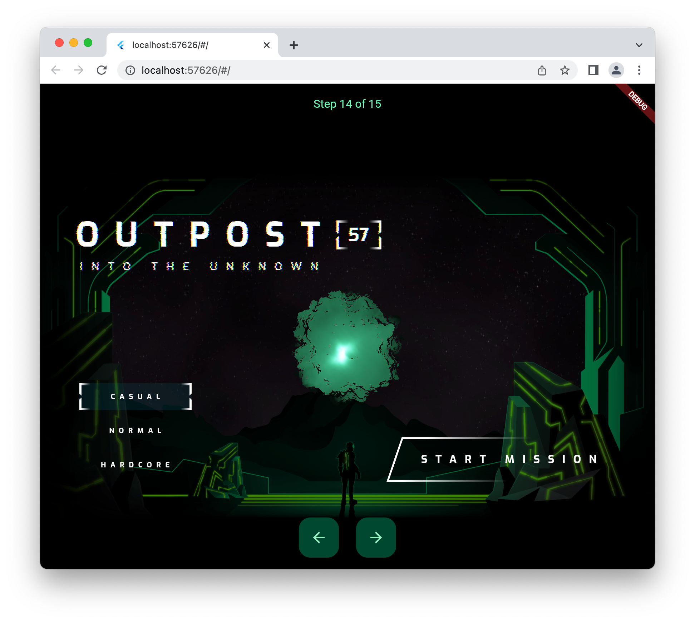

This is a demo version of the [Building next generation UIs in Flutter][] codelab.

This sample takes code from each step of the codelab linked above and turns it into
a single application with forward and backward buttons to enable stepping through the
steps of the codelab.

  [Building next generation UIs in Flutter]: https://codelabs.developers.google.com/codelabs/flutter-next-gen-uis
